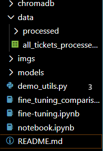

# Démonstration sur la classification par vectorisation
[](https://unlicense.org/)


[](https://jupyter.org/try)
[](https://python.org)

## Description
Dans un contexte où le LLM devient malgré lui le solveur universel pour tout problème en langage naturel, une grande partie des clients s'inquiète. Quid des hallucinations, des implications légales ou du budget? Cette démonstration se focalisera sur un outil proche des LLM, l'embedder appliqué à la classification de texte, afin d'éviter l'usage de ces modèles coûteux, lents et hors de notre gouvernance.

Ce repo contient le code démontré durant le devfest Dijon ainsi que quelques ressources utiles comme le code de réentrainement du modèle et le dataset splitté.

## Prérequis

### Librairies
Une version de python relativement récente est nécessaire (démo effectuée sous 3.12.3) avec jupyter d'installé et les widgets pour l'affichage. Veillez à avoir des outils de compilation C++ si vous êtes sous windows afin quer les dépendances puissent s'installer correctement: 
```bash
pip install ipykernel ipywidgets
```
Les dépendances s'installeront à travers les notebooks. Si un venv est activé, les dépendances s'installeront dans le venv.

### Modèles
Le code est construit de manière à utiliser des modèles d'embeddings présents sur la machine. Si vous souhaitez utiliser les votres, pensez à changer le chemin d'accès dans les cellules d'initialisation des modèles. Vous pouvez télécharger le modèle par défaut de ChromaDB [ici](https://huggingface.co/sentence-transformers/all-MiniLM-L6-v2). Vous pouvez aussi pull le repo associé (vous aurez peut-être besoin d'installer git Large File Storage):
```bash
git lfs install
git clone https://huggingface.co/sentence-transformers/all-MiniLM-L6-v2
```
Ou encore le télécharger automatiquement via le code en enlevant les paramètres `embedding_function` dans les fonctions de création de collection.
Exemple (cellule 8 dans Notebook.ipynb):
```python
collection = client.get_or_create_collection(name="tickets_label", configuration ={"hnsw": {"space": "cosine"}}, embedding_function=base_embedding)
```
deviendra:
```python
collection = client.get_or_create_collection(name="tickets_label", configuration ={"hnsw": {"space": "cosine"}})
```
Et le modèle sera téléchargé par ChromaDB.

Pour construire le modèle fine tuné, vous pouvez exécuter le fichier `fine-tuning.ipynb` en ayant une version du modèle de base all-MiniLM-L6-v2 dans le dossier models. Une version du modèle est disponible sur ce repo dans le dossier "models".

## Utilisation

Lancez simplement un notebook pour éxecuter le code en veillant à avoir bien indiqué le chemin d'accès à vos modèles. Pour la base chromadb, assurez vous d'avoir bien défini un dossier ```chromadb/``` à la racine du projet.

## Architecture du projet

- `chromadb/` Dossier de persistance de la base de données vectorielle.
- `data/` Contient le dataset source et le dataset segmenté pour l'évaluation, la classification et le fine-tuning situé dans `data/processed/`.
- `imgs/` Dossier contenant les images pour le markdown.
- `models/` Dossier contenant les modèles utilisés pour la vectorisation.
- `demo_utils.py` Fonctions utilitaires pour la démo, déplacées pour clarifier le code
- `fine_tuning.ipynb` Code permettant de finetuner le modèle de base.
- `fine_tuning_comparison.ipynb` Notebook aidant à visualiser la qualité du modèle finetuné par rapport au modèle de base
- `notebook.ipynb` Code présenté lors de la démo. Permet de lever une base de données vectorielle et de visualiser la qualité de la classification par vectorisation, et comparer les performances entre modèle de base et modèle finetuné.

## Licence
Ce code est sous licence The Unlicensed - plus de détails [ici](LICENSE.md)

_Note de l'auteur : Les citations, mentions et redirections vers ce projet sont appréciées mais pas obligatoires_

## Remarques

Il a été considéré de retirer les stopwords et d'utiliser des méthodes de processing telles que le stemming ou la lemmatization. Après avoir observé une baisse de performance et effectué quelques recherches, il a été soulevé que ces methodes réduisent la qualité de l'embedding et de la classification (d'après [S. F. Chaerul Haviana, S. Mulyono and Badie’Ah](https://ieeexplore.ieee.org/document/10295797))

## Sources
[S. F. Chaerul Haviana, S. Mulyono and Badie’Ah, "The Effects of Stopwords, Stemming, and Lemmatization on Pre-trained Language Models for Text Classification: A Technical Study," 2023 10th International Conference on Electrical Engineering, Computer Science and Informatics (EECSI), Palembang, Indonesia, 2023, pp. 521-527, doi: 10.1109/EECSI59885.2023.10295797.](https://ieeexplore.ieee.org/document/10295797)

[IT Service Ticket Classification Dataset](https://www.kaggle.com/datasets/adisongoh/it-service-ticket-classification-dataset)

[All-MiniLM-L6-v2](https://huggingface.co/sentence-transformers/all-MiniLM-L6-v2)
